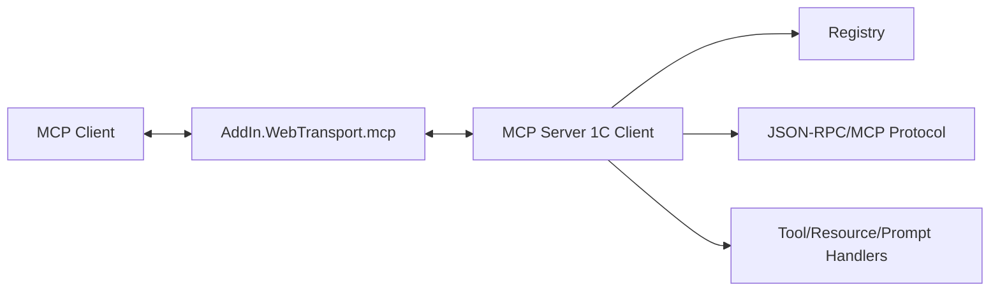
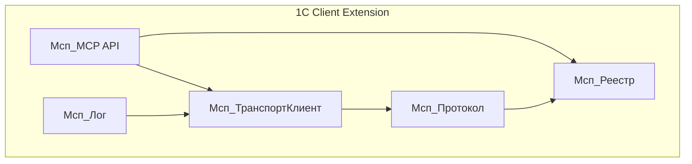
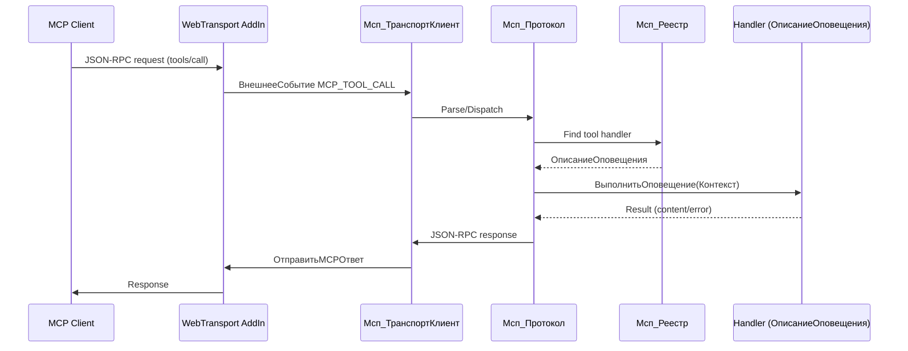
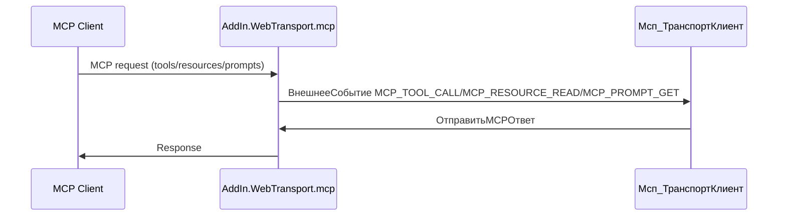

# MCP Server Architecture (MVP)

## HLD (Context)

```mermaid
flowchart LR
  Client[MCP Client] <--> Transport[AddIn.WebTransport.mcp]
  Transport <--> Server[MCP Server 1C Client]
  Server --> Registry[Registry]
  Server --> Protocol[JSON-RPC/MCP Protocol]
  Server --> Handlers[Tool/Resource/Prompt Handlers]
```

## Component Layers (MVP)

```mermaid
flowchart TB
  subgraph ClientSide[1C Client Extension]
    API[Мсп_MCP API]
    Registry[Мсп_Реестр]
    Protocol[Мсп_Протокол]
    Transport[Мсп_ТранспортКлиент]
    Log[Мсп_Лог]
  end

  API --> Registry
  API --> Transport
  Protocol --> Registry
  Transport --> Protocol
  Log --> Transport
```

## Sequence (tools/call)

```mermaid
sequenceDiagram
  participant C as MCP Client
  participant T as WebTransport AddIn
  participant S as Мсп_ТранспортКлиент
  participant P as Мсп_Протокол
  participant R as Мсп_Реестр
  participant H as Handler (ОписаниеОповещения)

  C->>T: JSON-RPC request (tools/call)
  T->>S: ВнешнееСобытие MCP_TOOL_CALL
  S->>P: Parse/Dispatch
  P->>R: Find tool handler
  R-->>P: ОписаниеОповещения
  P->>H: ВыполнитьОповещение(Контекст)
  H-->>P: Result (content/error)
  P->>S: JSON-RPC response
  S->>T: ОтправитьMCPОтвет
  T->>C: Response
```

## Transport (WebTransport MCP Events)

```mermaid
sequenceDiagram
  participant C as MCP Client
  participant T as AddIn.WebTransport.mcp
  participant S as Мсп_ТранспортКлиент

  C->>T: MCP request (tools/resources/prompts)
  T->>S: ВнешнееСобытие MCP_TOOL_CALL/MCP_RESOURCE_READ/MCP_PROMPT_GET
  S->>T: ОтправитьMCPОтвет
  T->>C: Response
```
